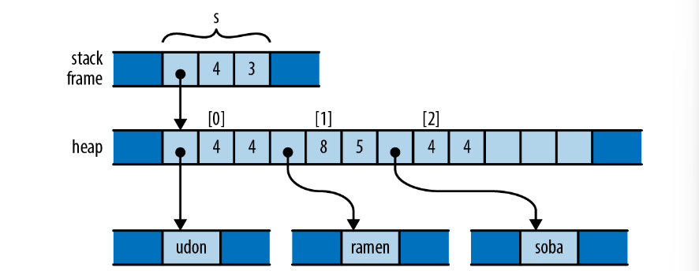
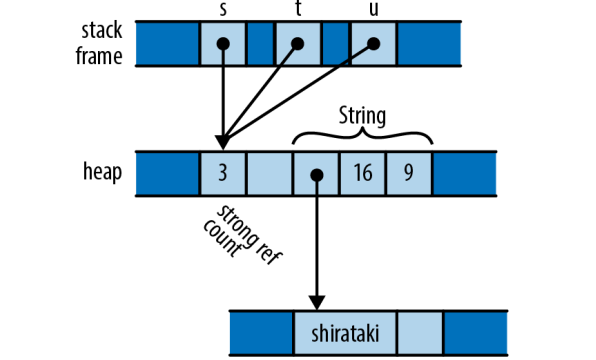

# 所有权与move

在内存管理方面，我们希望编程语言能够具备以下两个特点：

- 我们希望内存能在我们想要释放的时候被及时释放。这样我们可以控制程序的内存消耗。
- 我们永远不希望使用一个指向已经被释放的对象的指针。这会导致未定义行为，进而导致崩溃和安全漏洞。

但这两点看起来似乎是相互矛盾的：释放一个还有指针指向的对象的内存必定会导致悬垂指针。几乎所有的主流编程语言都属于两个阵营之一，取决于它们放弃了哪一点：

- “安全优先”的阵营使用垃圾回收来管理内存，自动释放那些没有指针指向的对象。这种做法通过将对象一直保持到没有指针指向来避免悬垂指针。几乎所有的现代语言都落入了这个阵营，包括Python、JavaScript、Ruby、Java、C#、Haskell。

    但依赖垃圾回收意味着放弃控制对象被回收的精确时间。垃圾收集器通常都令人讨厌，并且理解为什么内存没有如你所料的被释放可能会是一个挑战。

- “控制优先”的阵营让你自己负责释放内存。程序的内存消耗完全由你控制，但如何避免悬垂指针成了你最大的问题。C和C++是这个阵营里仅有的主流语言。

    如果你从没犯过错，那说明你很厉害。但证据表明，你最终还是会犯错。指针的错误使用一直都是那些被报导的安全问题的罪魁祸首。

Rust旨在同时保证安全和性能，因此这两种阵营都是不可接受的。但如果兼顾两者很简单的话，早就有人做出来了。要想兼顾两者，必须从根本上作出改变。

Rust以一种令人惊讶的方式打破了这个死锁：严格限制程序使用指针的方法。这一章和接下来将专注于解释这些限制和为什么它们能解决问题。你常用的一些程序结构可能也不符合这些规则，你可能需要寻找替代方案。但这些限制的最终效果是给这种混乱带来了足够的秩序，以允许Rust在编译期检查你的程序是否能避免内存安全错误：悬垂指针、两次释放、使用未初始化的内存等。在运行时，你的指针只是简单的地址，就像在C和C++中一样。不同的是你的代码已经被证明是安全的。

这些规则也为Rust实现安全的并发编程奠定了基础。Rust精心设计的线程原语可以让这些保证内存安全的规则也能保证你的代码可以避免数据竞争。Rust程序中的一个bug不可能导致一个线程破坏另一个线程的数据进而导致在不相干的地方出现很难复现的错误。多线程代码中的不确定行为被那些专为它设计的特性——互斥锁、消息通道、原子类型等完全隔离，不会出现在正常的内存访问中。C和C++中的多线程代码臭名昭著，但Rust漂亮地解决了它。

即使有这些限制，你会发现它仍然可以足够灵活地处理几乎所有的任务，而它可以消除内存管理和并发bug的优势将证明你需要改变——你需要对自己的风格进行调整。这是Rust最大的赌注，也是它的核心和成功之处。本书的作者们看好Rust，正是因为我们在C和C++方面有丰富的经验。对我们来说，遵守Rust的规则不费吹灰之力。[^1]

[^1]:译者注：此处原文：For us, Rust's deal is a no-brainer.

Rust的规则可能和你在其他编程语言中看到的不同。了解怎么和它们一起工作并利用它们的优势，在我们看来是学习Rust的核心挑战。在这一章中，我们将首先展示相同的潜在问题如何在其他语言中导致问题，以此来深入了解Rust规则背后的逻辑和意图。之后，我们将详细解释Rust的规则、从概念和机制层面探究所有权的含义、如何在各种场景下追踪所有权的变化、以及一些为了提供更大的灵活性而打破这些规则的类型。

## 所有权

如果你读过很多C或C++的代码，你可能会看到过有注释说某个类的实例 *拥有(own)* 某些它指向的其他对象。这一般意味着拥有者可以决定何时释放它拥有的对象：当拥有者被销毁时，它会销毁所有它拥有的对象。

例如，假设你写了如下C++代码：
```C++
    std::string s = "frayed knot";
```

字符串`s`在内存中的表示通常如”图4-1”所示：


<p align="center">图4-1 一个栈上的C++ <code>std::string</code>，指向它在堆上分配的内存</p>

这里，实际上`std::string`对象本身总是只有3个字长，包括一个指向堆上分配的缓冲区的指针、缓冲区的最大容量（也就是在不重新分配缓冲区的情况下，能存储的最大文本长度），和已经持有的文本的长度。这些都是`std::string`的私有字段，使用者不能访问。

一个`std::string`拥有它的缓冲区，当程序销毁string时，它的析构函数会释放缓冲区。以前，一些C++库在多个`std::string`值之间共享单个缓冲区，使用一个引用计数来决定缓冲区什么时候应该被释放。较新版本的C++标准有效地排除了这种表示，所有现代的C++库都是用上图中的方式。

在这些场景中，人们普遍认为尽管其他代码创建这些被拥有的内存的指针是没问题的，但这些代码有责任确保在所有者决定销毁它拥有的对象之前所有的这种指针都已消失。你可以创建一个指向`std::string`的缓冲区的指针，但当string被销毁后，你的指针就无效了，你必须自己保证不再使用它。拥有者决定所拥有对象的生命周期，所有其他的对象必须尊重它的决定。

我们在这里使用`std::string`做为例子展示了C++中的所有权是什么样子的：它只是一个标准库普遍遵守的规范。然而即使语言鼓励你也遵守相似的实践，但如何设计你自己的类型最终还是取决于你。

但在Rust中，所有权的概念被内建在语言之中，并且通过编译期检查确保强制执行。每个值都只有一个决定它生命周期的所有者。当所有者被释放——Rust中的术语叫 *dropped* ——它拥有的值也会被dropped。这些规则的目的是让你可以通过检查代码很容易的查明某个值的生命周期，并给你系统语言应有的控制生命周期的能力。

一个变量拥有它的值。当控制流离开了变量声明的语法块，变量会被drop，因此它的值也会随之一起drop。例如：
```Rust
    fn print_padovan() {
        let mut padovan = vec![1,1,1];  // 在这里分配
        for i in 3..10 {
            let next = padovan[i-3] + padovan[i-2];
            padovan.push(next);
        }
        println!("P(1..10) = {:?}", padovan);
    }
```

变量`padovan`的类型是`Vec<i32>`，一个32位整数的vector。在内存中，`padovan`看起来将类似于”图4-2”。


<p align="center">图4-2 栈上的<code>Vec&lt;i32&gt;</code>，指向它在堆上的缓冲区</p>

这和我们之前展示的C++的`std::string`非常像，除了缓冲区里的元素是32位整数，而不是字符。注意存储`padovan`的指针、容量和长度的字都在`print_padovan`函数的栈帧中，只有vector的缓冲区是在堆上分配的。

和之前展示的string `s`一样，vector拥有它用来存储元素的缓冲区。当变量`padovan`在函数结尾处离开作用域时，程序会drop这个vector。因为vector拥有它的缓冲区，缓冲区也会随之drop。

Rust的`Box`类型是另一个所有权的例子。`Box<T>`是一个指针，指向一个存储在堆上的类型`T`的值，调用`Box::new(v)`会在堆上分配一些空间，把值`v`移动进去，然后返回一个`Box`指向堆上的空间。因为一个`Box`拥有它所指向的空间，当`Box`被drop的时候，堆上的空间也会被释放。

例如，你可以像这样在堆上分配一个元组：
```Rust
    {
        let point = Box::new((0.625, 0.5));     // point在这里分配
        let label = format!("{:?}", point);     // label在这里分配
        assert_eq!(label, "(0.625, 0.5)");
    }                                           // point和label都在这里drop
```

当程序调用`Box::new`时，它会在堆上为一个由两个`f64`值组成的元组分配空间，把它的参数`(0.625, 0.5)`移动进去，然后返回一个指向它的指针。当控制流到达`assert_eq!`的调用时，栈帧如”图4-3”所示。


<p align="center">图4-3 两个本地变量，每个都拥有堆上的一块内存</p>

栈帧本身存储了变量`point`和`label`，每一个变量都指向自己拥有的堆上的内存。当它们被drop时，它们拥有的内存也随之释放。

与变量拥有它们的值类似，结构体拥有它们的字段，元组、数组、vector拥有它们的元素。

```Rust
    struct Person { name: String, birth: i32 }
    let mut composers = Vec::new();
    composers.push(Person { name: "Palestrina".to_string(),
                            birth: 1525 });
    composers.push(Person { name: "Dowland".to_string(),
                            birth: 1563 });
    composers.push(Person { name: "Lully".to_string(),
                            birth: 1632 });
    for composer in &composers {
        println!("{}, born {}", composer.name, composer.birth);
    }
```

这里，`composers`是一个`Vec<Person>`：一个结构体的vector，每个结构体有一个字符串和数字。在内存中，`composers`的最终结果如”图4-4”所示。


<p align="center">图4-4 一个更复杂的所有权树</p>

这里有很多的所有权关系，但每一个都很直观：`composers`拥有一个vector，vector拥有它的元素，每一个元素是一个`Person`结构体；每个结构体拥有它的字段；其中的字符串字段拥有它的文本。当控制流离开了`composers`声明的作用域，程序会drop它的值，同时drop它拥有的所有内容。如果这里还有其他类型的集合，例如`HashMap`、`BTreeSet`，那么过程也是一样的。

到这里，让我们退后一步并思考我们到目前为止展示的所有权关系。每个值都只有一个所有者，这样很容易决定什么时候drop这个值。但单个值可能拥有很多其他值：例如，vector `composers`拥有它的所有元素。这些元素也可能反过来拥有其他值：`composers`的每个元素拥有一个字符串，字符串又拥有它的文本。

所有者和它们拥有的值组成了 *树* ：值的拥有者是它的父结点，值拥有的值是它的孩子结点。每棵树的根结点是一个变量；当这个变量离开作用域时，整个树都会随之销毁。我们可以在`composers`的图中看到这样一棵所有权的树：它不是搜索树数据结构意义上的“树”、也不是DOM元素组成的HTML文档树。相反，我们有一个由混合类型构建的树，Rust的单一所有者规则禁止任何可能使布局变得比树更复杂的连接操作。Rust程序中的每个值都是树中的一个结点，树的根就是变量。

Rust程序通常完全不需要像C和C++程序中使用`free`和`delete`一样显式drop值。Rust中drop值的方式是将它从所有权树移除：当离开作用域时、或者从vector中删除元素时、或者类似的情况。这时，Rust保证值会和它拥有的所有值一起被drop掉。

在某种意义上，Rust不如其他语言强大：每个其他的编程语言都允许你在对象之间构建任意的关系图，这些对象以你认为合适的方式互相指向。但正因为Rust不够强大，所以它才可以对你的程序进行更强大的分析。Rust的安全保证可以实现的原因就是你的代码中可能出现的所有权关系更加容易处理。这是我们之前提到的Rust的“激进赌注”的一部分：Rust声称，在实践中，解决问题时通常有足够的灵活性来保证至少有一些完美的解决方案可以在语言强加的限制范围内实现。

也就是说，我们到目前为止解释的所有权的概念太过死板以至于很难使用。Rust在以下几个方面扩展了这个简单的想法：

- 你可以将值从一个所有者移动到另一个所有者。这允许你构建、更改、拆除所有权树。
- 很简单的类型例如整数、浮点数和字符被所有权规则排除在外。它们被称为`Copy`类型。
- 标准库提供了引用计数的指针类型`Rc`和`Arc`，它们允许值在一定的限制下可以有多个所有者。
- 你可以“借用一个值的引用”，引用是生命周期受限的非占有的指针。

这些策略中的每一条都改善了所有权模型的灵活性，同时仍然坚持Rust的承诺。我们将依次介绍它们，引用将在下一章介绍。

## move

在Rust里对大多数类型来说，赋值给变量、把值传给函数、或者从函数返回值并不会拷贝这个值：它们只会 *move* 它。源对象放弃了值的所有权，把所有权转移给了目的对象，同时源对象变为未初始化的状态；此时目的对象控制值的生命周期。Rust程序一次一个值、一次move一个地构建和拆除复杂的结构。

你可能会很惊讶Rust改变了这些基础操作的含义。确实赋值操作很早之前就已经有了明确的含义。然而，如果你仔细观察过不同的语言是怎么处理赋值操作的，你就会发现不同语言的处理方式有很大差别。这种差别也让我们能更容易的看出Rust的选择的含义和结果。

考虑下面的Python代码：
```python
    s = ['udon', 'ramen', 'soba']
    t = s
    u = s
```

每一个Python对象都有一个引用计数，用来追踪当前有多少个值指向它。因此在对`s`赋值以后，程序的状态如”图4-5”所示（注意有一些内容被省略了）。


<p align="center">图4-5 Python如何在内存中表示一个字符串的列表</p>

因为只有`s`指向列表，所以列表的引用计数是1；因为列表是唯一指向那些字符串的对象，所以每个字符串的引用计数也是1。

当程序执行到`t`和`u`的赋值时会发生什么？Python把赋值操作简单实现为让目标变量也指向源变量指向的对象，然后增加对象的引用计数。因此，这段程序的最终状态如”图4-6”所示：


<p align="center">图4-6 在Python里把<code>s</code>赋值给<code>t</code>和<code>u</code>的结果</p>

Python拷贝了`s`的指针，并赋给了`t`和`u`，然后把列表的引用计数更新为3。Python中的赋值开销很低，但因为它创建了新的指向对象的引用，我们必须维护引用计数来知道我们什么时候可以释放值。

现在考虑下面类似的C++代码：
```C++
    using namespace std;
    vector<string> s = { "udon", "ramen", "soba" };
    vector<string> t = s;
    vector<string> u = s;
```

一开始`s`的值在内存中如”图4-7”所示。


<p align="center">图4-7 C++里一个字符串的vector在内存中的表示</p>

当把`s`赋值给`t`和`u`时会发生什么呢？在C++里赋值一个`std::vector`会产生一份这个vector的拷贝；`std::string`的行为类似。因此当程序到达末尾时，它实际上有3个vector和9个字符串（”图4-8”）。


<p align="center">图4-8 在C++里把<code>s</code>赋值给<code>t</code>和<code>u</code>的结果</p>

根据值的不同，C++里的赋值可能会消耗任意数量的内存和处理器时间。然而，它的优势是，程序可以很容易的决定何时释放这些内存：当变量离开作用域时，所有这里分配的内存都会被自动释放。

某种意义上，C++和Python选择了相反的策略：Python里赋值操作开销很小，但引用计数（通用一点的说法，垃圾回收）开销很大。C++保持了内存的所有权都很清楚，但赋值时会执行对象的深拷贝导致开销很大。C++程序员通常不太热衷于这种选择：深拷贝可能开销很大，通常会有更好的替代方法。

那么Rust中的类似程序会怎么做呢？代码如下：
```Rust
    let s = vec!["udon".to_string(), "ramen".to_string, "soba".to_string()];
    let t = s;
    let u = s;
```

类似于C和C++，Rust把字符串字面量例如`"udon"`存储在只读内存中，因此，为了更清楚地与C++和Python的例子进行对比，我们调用了`to_string`来获得在堆上分配的`String`值。

在`s`的初始化之后，因为Rust和C++有相似的vector和string表示，所以看起来和C++中的情况很像（”图4-9”）。


<p align="center">图4-9 Rust中一个字符串的vector在内存中的表示</p>

但回想一下，Rust里大多数类型的赋值操作都是把值从源对象 *移动* 到目的对象，然后源对象变为未初始化的状态。因此`t`初始化完之后，程序的内存状态如”图4-10”所示。


<p align="center">图4-10 Rust里把<code>s</code>赋值给<code>t</code>之后的结果</p>

这里发生了什么？赋值语句`let t = s;`把vector的三个字段从`s`移动到了`t`；现在`t`拥有了这个vector。vector的元素则仍待在原来的位置，string的位置也没有发生变化。每一个值都只有一个所有者，尽管所有者已经变了。不需要调整引用计数，并且编译器现在把`s`视作未初始化的状态。

因此当我们到达`let u = s;`时会发生什么呢？这将会把`s`赋值给`u`。Rust禁止使用未初始化的值，所以编译器会报如下错误：
```
    error[E0382]: use of moved value: `s`
      |
    7 |     let s = vec!["udon".to_string(), "ramen".to_string(), "soba".to_string()];
      |         - move occurs because `s` has type `Vec<String>`,
      |           which does not implement the `Copy` trait
    8 |     let t = s;
      |             - value moved here
    9 |     let u = s;
      |             ^ value used after move
```

考虑Rust在这里使用move的结果。类似于Python，赋值操作开销很小，程序简单地把vector的三个字长的头部从一个点移动到了另一个点。但和C++类似，所有权总是很清晰：程序不需要引用计数或者垃圾回收来判断什么时候释放vector的元素和string的内容。

而为此付出的代价是如果赋值时想要的是拷贝操作那么必须显式写出。如果你想要最后和C++程序一样的状态，也就是每个变量都有独立的拷贝，那么必须调用vector的`clone`方法，它会对vector和它的元素执行深拷贝：
```Rust
    let s = vec!["udon".to_string(), "ramen".to_string(), "soba".to_string()];
    let t = s.clone();
    let u = s.clone();
```

你也可以通过Rust的引用计数指针类型复现Python代码的行为，我们将在”Rc和Arc：共享所有权”这一节中简要介绍这一点。

### 更多move的操作

在我们上面展示的初始化例子中，都是在使用`let`语句引入变量的同时把值赋给它们。赋值给一个变量将与此有细微的不同，如果你把值移动进一个已经被初始化的变量，Rust会drop变量之前的值。例如：
```Rust
    let mut s = "Govinda".to_string();
    s = "Siddhartha".to_string();   // 值"Govinda"在这里drop
```

在这段代码中，当程序把`"Siddhartha"`赋值给`s`时，它之前的值`"Govinda"`首先被drop掉。但考虑下面的代码：
```Rust
    let mut s = "Govinda".to_string();
    let t = s;
    s = "Siddhartha".to_string();   // 这里不会drop任何内容
```

这一次，`t`拿走了`s`中原本的字符串的所有权，因此当我们给`s`赋值时，它是未初始化的。在这种场景下，不会发生drop。

我们在这里使用初始化和赋值的例子是因为它们足够简单，但Rust在几乎所有场景下都使用move。向函数传参会把所有权移动给函数的参数；从函数返回值会把所有权移动给调用者；创建一个元组会把值移动给元组，等等。

你现在可能对我们之前章节给出的例子中到底发生了什么有了更深入的理解。例如，当我们构建作曲家的vector时，我们写了：
```Rust
    struct Person { name: String, birth: i32 }

    let mut composers = Vec::new();
    composers.push(Person { name: "Palestrina".to_string(), 
                            birth: 1525 });
```

这段代码展示了除了初始化和赋值之外，move发生的几个场景：

*从函数返回值*

&emsp;&emsp;调用`Vec::new()`会创建一个新的vector并返回，返回的并不是指向vector的指针，而是vector本身：它的所有权从`Vec::new`移动到了变量`composers`。类似的，`to_string`调用返回了一个新的`String`实例。

*构造新的值*

&emsp;&emsp;新的`Person`结构体的`name`字段被`to_string`的返回值初始化。结构体获得了这个字符串的所有权。

*向函数传递值*

&emsp;&emsp;整个`Person`结构体，而不是指向它的指针，被传递给vector的`push`方法，这个方法将值移动到了结构体的尾部。vector获得了`Person`的所有权，因此也变成了name `String`的间接所有者。

像这样移动值可能听起来并不是很高效，但有两件事需要记住。第一，move只作用于恰当的值，而不作用于它们拥有的堆存储。对于vector和string来说， *恰当的值* 是它们三个字长的头部，潜在的很多元素的数组和文本缓冲区仍然停留在堆中原本的位置。第二，Rust编译器的代码生成部分擅长“看穿”所有这些move；在实践中，机器码通常会直接把值存储到它最终的位置。

### move和控制流

之前的例子中的控制流都很简单，move会如何影响更复杂的代码呢？通用的原则是，如果一个变量的值被移动走并且从此之后没有再被赋予一个新的值，那么它被认为是未初始化的。例如，如果一个变量在`if`表达式的条件判断之后还是有值的，那我们在两个分支中都可以使用它：
```Rust
    let x = vec![10, 20, 30];
    if c {
        f(x);   // ... 在这里移动x的值是ok的
    } else {
        g(x);   // ... 在这里移动x的值也是ok的
    }
    h(x);   // 错误：如何任何一个分支使用了x，那么x在此处将是未初始化的
```

出于类似的原因，在循环里移动一个变量的值是禁止的：
```Rust
    let x = vec![10, 20, 30];
    while f() {
        g(x);   // 错误：x会在第一次迭代时被移动
                // 第二次迭代时就是未初始化状态 
    }
```

也就是说，我们需要在每次迭代里都重新赋予它一个新值：
```Rust
    let mut x = vec![10, 20, 30];
    while f() {
        g(x);       // 移动x的值
        x = h();    // 给x一个新值
    }
```

### move和索引

我们已经提到过move会将源对象设置为未初始化状态，目的对象会获得值的所有权。但并不是每一种值的所有者都可以设置为未初始化状态。例如，考虑下面的代码：
```Rust
    // 创建一个string的vector："101", "102", ... "105"
    let mut v = Vec::new();
    for i in 101 .. 106 {
        v.push(i.to_string());
    }

    // 从vector中取出随机的元素
    let third = v[2];   // 错误：不能移动Vec的索引
    let fifth = v[4];   // 这里也是一样
```

如果想让这段代码工作，Rust需要记住这个vector的第3和第5个元素变成了未初始化状态，然后一直追踪这些信息直到这个vector被drop。在一般情况下，vector需要携带额外的信息来指示哪些元素还可用，哪些变为了未初始化。显然这不是一门系统编程语言应该有的行为；一个vector应该只是一个vector。事实上，Rust会报错拒绝上面的代码：
```
    error[E0507]: cannot move out of index of `Vec<String>`
       |
    14 |     let third = v[2];
       |                 ^^^^
       |                 |
       |                 move occurs because value has type `String`,
       |                 which does not implement the `Copy` trait
       |                 help: consider borrowing here: `&v[2]`
```

移动到`fifth`的语句也会报类似的错误。在这些错误信息中，Rust建议使用引用，这样就可以在不移动的情况下访问元素。这通常是你想要的。但如果我们真的想从vector中移出一个元素呢？你需要找到一些不违反类型限制的方法来做这件事。这里有三种方法：
```Rust
    // 创建一个string的vector："101", "102", ... "105"
    let mut v = Vec::new();
    for i in 101 .. 106 {
        v.push(i.to_string());
    }

    // 1. 弹出vector尾部的元素
    let fifth = v.pop().expect("vector empty!");
    assert_eq!(fifth, "105");

    // 2. 移出给定位置的元素，并把最后一个元素移动过来：
    let second = v.swap_remove(1);
    assert_eq!(second, "102");

    // 3. 用另一个值和我们想移出的值交换
    let third = std::mem::replace(&mut v[2], "substitute".to_string());
    assert_eq!(third, "103");

    // 让我们看看vector中还剩下什么。
    assert_eq!(v, vec!["101", "104", "substitute"]);
```

这三种方法都从vector中移出一个元素，但仍然保证vector处于没有空隙的状态，可能长度还会变小。

像`Vec`这样的集合类型也提供方法通过循环消费它们的所有元素：
```Rust
    let v = vec!["liberté".to_string(),
                 "égalité".to_string(),
                 "fraternité".to_string()];
    for mut s in v {
        s.push('!');
        println!("{}", s);
    }
```

当直接把vector传给循环时，例如`for ... in v`，这会把`v`中的所有元素 *移出* vector，然后`v`变为未初始化。`for`循环内部的机制会获取vector的所有权，然后把它分解为若干元素。每一次迭代时，循环都会把一个元素移动到变量`s`。因为`s`现在拥有这个字符串，所以我们可以在循环里修改它，然后再打印。因为vector本身不再对代码可见，所以在循环的过程中当它部分为空时没有任何东西可以观测到它。

如果你确实发现你需要从所有者中移出一个编译器无法追踪的值，你可以考虑将所有者的类型改为可以动态追踪是否有值的类型。例如，这里有一个之前示例的变体：
```Rust
    struct Person { name: Option<String>, birth: i32 }

    let mut composers = Vec::new();
    composers.push(Person { name: Some("Palestrina".to_string()),
                            birth: 1525 });
```

你不能这样做：
```Rust
    let first_name = composers[0].name;
```

这只会和犯和之前一样的“不能移出索引”的错误。但因为你把`name`字段的类型从`String`改为了`Option<String>`，这意味着`None`是这个字段的一个合法的取值，因此下面的代码可以生效：
```Rust
    let first_name = std::mem::replace(&mut composers[0].name, None);
    assert_eq!(first_name, Some("Palestrina".to_string()));
    assert_eq!(composers[0].name, None);
```

`replace`调用移出了`composers[0].name`的值，留下了一个`None`，并把原本的值的所有权传递给了调用者。事实上，这种使用`Option`的方法非常普遍，所以这个类型提供了一个`take`方法来实现这个特殊的用途。你可以使用下面的代码更清晰地完成上述操作：
```Rust
    let first_name = composers[0].name.take();
```
这里的`take`调用和之前的`replace`调用有相同的效果。

## Copy类型：move的例外

到目前为止我们的例子涉及vector、string、和其他可能潜在地使用大量内存并且拷贝开销很大的类型。move保证了这些类型的所有权的明晰、也保证了赋值的开销很小。但对于简单类型例如整数或字符，这种谨慎的处理方式事实上并不是必须的。

让我们比较一下赋值一个`String`和赋值一个`i32`值时内存中会发生什么：
```Rust
    let string1 = "somnambulance".to_string();
    let string2 = string1;

    let num1: i32 = 36;
    let num2 = num1;
```

运行完这段代码后，内存布局如”图4-11”所示。


<p align="center">图4-11 赋值<code>String</code>会移动它，而赋值<code>i32</code>会拷贝它</p>

类似于之前的vector，赋值会把`string1` *移动* 到`string2`，这样我们就不会得到两个负责释放同一个缓冲区的字符串。然而，`num1`和`num2`的情况与此不同。`i32`只是在内存中的一种位模式，它并不拥有任何堆上的资源、也不依赖任何它本身所占的字节之外的东西。此时如果我们把它的位都移动给`num2`，我们就得到了一个和`num1`完全互相独立的拷贝。

移动一个值会导致源对象变为未初始化。但是尽管把`string1`视为无值是一个基本的目的，但如果对`num1`也这么做是毫无意义的，继续使用`num1`不会导致任何危害。move的优势在这里并不适用，反而变得不够便捷。

之前我们谨慎的说过 *大多数* 类型会被移动，现在我们来到了例外的情况，也就是Rust称之为`Copy type`的类型。赋予一个`Copy`类型的值会拷贝它，而不是移动它。源对象仍然保持初始化状态和可用性，它的值不会发生改变。向函数和构造器传递`Copy`类型也类似。

标准的`Copy`类型包括所有的机器整数和浮点数类型、`char`和`bool`类型，以及少数其他类型。所有元素都是`Copy`类型的元组或数组也是`Copy`类型。

只有简单的逐位拷贝的类型才可以是`Copy`类型。正如我们解释过的，`String`不是`Copy`类型，因为它拥有一个在堆上分配的缓冲区；与此类似，`Box<T>`也不是`Copy`类型，它拥有一个堆上分配的对象；代表操作系统中文件句柄的`File`类型，也不是`Copy`类型，赋值这样一个值意味着向操作系统请求另一个文件句柄。类似的，表示一个互斥锁的`MutexGuard`类型，也不是`Copy`类型，拷贝这个类型没有任何意义，因为在一个时间点只有一个线程可以持有锁。

根据经验，任何在drop时要做一些特殊事情的类型不可能是`Copy`类型：一个`Vec`需要释放它的内存，一个`File`需要关闭它的文件句柄，一个`MutexGuard`需要释放它的锁，等等。对这些类型逐位拷贝会导致搞不清它们中的哪一个要负责释放原始的资源。

自定义的类型呢？默认情况下，`struct`和`enum`不是`Copy`类型：
```Rust
    struct Label { number: u32 }
    fn print(l: Label) { println!("STAMP: {}", l.number); }

    let l = Label { number: 3 };
    print(l);
    println!("My label number is: {}", l.number);
```

这不能通过编译，Rust会报错：
```
    error: borrow of moved value: `l`
       |
    10 |     let l = Label { number: 3 };
       |         - move occurs because `l` has type `main::Label`,
       |           which does not implement the `Copy` trait
    11 |     print(l);
       |           - value moved here
    12 |     println!("My label number is: {}", l.number);
       |                                        ^^^^^^^^
       |                  value borrowed here after move
```

因为`Label`不是`Copy`类型，将它传递给`print`会把值的所有权移动给`print`函数的参数，在函数返回时会drop掉值。但这非常愚蠢，一个`Label`只是一个`u32`套壳。没有理由将`l`传递给`print`时应该移动值。

但用户自定义类型只是默认不是`Copy`类型。如果你的结构体的所有字段都是`Copy`类型，那么你可以通过在定义上方加上属性`#[derive(Copy, Clone)]`来把它变为`Copy`类型，像这样：
```Rust
    #[derive(Copy, Clone)]
    struct Label { number: u32 }
```

这样修改之后，上面的代码就可以通过编译了。然而，如果我们用不是`Copy`类型的字段来修改这个类型的话，也不能通过编译。假设我们要编译下面的代码：
```Rust
    #[derive(Copy, Clone)]
    struct StringLabel { name: String }
```

它会报这样的错误：
```
    error[E0204]: the trait `Copy` may not be implemented for this type
     --> ownership_string_label.rs:7:10
      |
    7 | #[derive(Copy, Clone)]
      |          ^^^^
    8 | struct StringLabel { name: String }
      |                      ------------ this field does not implement `Copy`
```

为什么不默认把用户自定义类型设置为`Copy`类型？一个类型是否是`Copy`类型对接下来的代码如何使用它有巨大的影响：`Copy`类型更加的灵活，因为赋值和相关的操作不会导致源对象变得未初始化。但对于类型的实现者来说，恰恰相反：`Copy`类型所能包含的类型十分有限，而非`Copy`类型可以使用堆上的内存并且拥有自己的资源。因此将一个类型标记为`Copy`代表着实现者的一个承诺：如果之后它必须要修改为非`Copy`类型，很多使用它的代码都需要修改。

虽然C++允许你重载赋值运算符和自定义拷贝和移动构造函数，但Rust不允许这种自定义。在Rust里，所有的移动都是逐字节的浅拷贝，同时把源对象设置为未初始化。拷贝与此类似，除了源对象仍然是初始化过的状态。这确实意味着C++类可以提供Rust类所不能提供的方便接口：看起来普通的代码会隐式的调整引用计数、推迟开销很大的拷贝操作、或者使用其它复杂的实现技巧。

但C++中的这种灵活性会导致基本操作例如赋值、传参、返回值变得不可预料。例如，这一章之前的部分我们展示过在C++里把一个变量赋给另一个可能会需要任意数量的内存和处理器时间。Rust的原则之一就是开销对程序员来说必须是明显的。基本的操作必须保持简单。潜在的开销很大的操作必须是显式的，例如在更早的例子中调用`clone`来获取vector和它包含的string的深拷贝。

在这一节中，我们谈到了术语`Copy`和`Clone`，模糊地将它们视作类型具有的特征。事实上，它们是`trait`的示例，它是Rust的一个开发的工具，你可以通过它根据类型能做什么对类型进行分类。我们将在”第11章”中讨论一般性的trait，在”第13章”中专门讨论`Copy`和`Clone`。

## Rc和Arc：共享所有权

尽管典型的Rust代码中几乎所有的值都只有一个所有者，但在一些情况下，很难让每个值的所有者都有你想要的生命周期，这时你可能会希望值一直保持有效，直到每一个所有者都使用完它。对于这种情况，Rust提供了引用计数类型`Rc`和`Arc`。正如你对Rust的期待一样，它们是安全的：你不可能忘记调整引用计数、创建其它指向它的指针、或者出现其他使用C++的引用计数指针类型时可能出现的问题。

`Rc`和`Arc`类型非常相似，它们唯一的不同之处在于`Arc`可以直接安全地在线程之间共享——名称`Arc`是 *原子引用计数* 的缩写——`Rc`则使用更快一些的非线程安全代码来更新引用计数。如果你不需要在线程之间共享指针，那就没有必要承担`Arc`的性能损失，所以你应该使用`Rc`；Rust会阻止你无意间在线程之间传递`Rc`。这两种类型在其他方面都是等价的，因此在本节的剩余部分，我们将只讨论`Rc`。

之前我们曾经展示过Python使用引用计数来管理值的生存周期。你可以使用`Rc`来在Rust中实现相似的效果。考虑下面的代码：
```Rust
    use std::rc::Rc;

    // Rust可以推断出所有这些类型，写出来是为了更清楚
    let s: Rc<String> = Rc::new("shirataki".to_string());
    let t: Rc<String> = s.clone();
    let u: Rc<String> = s.clone();
```

对于任意类型`T`，一个`Rc<T>`值是一个指向在堆上分配的`T`类型值的指针，同时还附有一个引用计数。克隆一个`Rc<T>`类型的值并不意味着拷贝`T`，它只是简单的创建另一个指向它的指针，并且递增引用计数。因此上面的代码会产生如”图4-12”所示的内存布局：


<p align="center">图4-12 一个有三个引用的引用计数字符串</p>

这三个`Rc<String>`指针都指向内存中的同一块内存，这块内存里存储了一个引用计数和一个`String`。通常的所有权规也适用于`Rc`指针，当最后一个`Rc`指针drop时，Rust会同时drop掉`String`。

你可以直接对`Rc<String>`使用任何`String`的方法：
```Rust
    assert!(s.contains("shira"));
    assert_eq!(t.find("taki"), Some(5));
    println!("{} are quite chewy, almost bouncy, but lack flavor", u);
```

一个`Rc`指针拥有的值是不可变的。假设你尝试在字符串的结尾添加文本：
```Rust
    s.push_str(" noodles");
```

Rust将会报错：
```
    error: cannot borrow data in an `Rc` as mutable
      --> ownership/ownership_rc_mutability.rs:13:5
       |
    13 |     s.push_str(" noodles");
       |     ^ cannot borrow as mutable
       |
```

Rust的内存和线程安全保证依赖于没有值既是共享的又是可变的。Rust假设`Rc`指针指向的值要被共享，因此它必须是不可变的。我们将在”第5章”解释为什么限制要这么严格。

 使用引用计数来管理内存的一个已知问题就是，如果两个引用计数的值互相指向彼此，那么每一个都会导致对方的引用计数不可能降到0，因此值永远不会被释放（”图4-13”）。

 

<p align="center">图4-13 一个引用计数循环，这些对象永远不会被释放</p>

在Rust中出现这种泄漏是可能的，但这种情况非常少见。要想创建这样一个循环，你必须让旧值指向新值，这也意味着旧值要是可变的。因为`Rc`指针指向的值不可变，所以通常是不能创建这样的循环的。然而，Rust确实提供了一些方法创建部分可变的值的方法；这被称为 *内部可变性* ，我们将在”内部可变性”一节中介绍。如果你将那些技术和`Rc`指针结合使用，那么你确实能创建出一个循环，然后造成内存泄漏。

你可以使用 *弱指针* `std::rc::Weak`来避免使用`Rc`指针创建循环的情况。然而，我们不会在本书中介绍这些，你可以查看标准库的文档获取详情。

move和引用计数指针是两种缓解所有权树过于死板的方法。在下一章中，我们将看到第三种方法：借用值的引用。一旦你对所有权和借用都感到很舒服，那你就已经跨过了Rust的学习曲线中最陡峭的部分，而且已经准备好接受Rust独特的优势。
