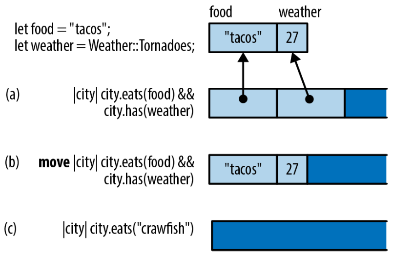
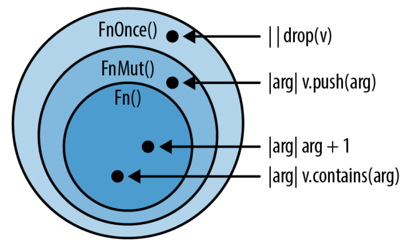

# 闭包

 *Save the environment! Create a closure today!* 

<p align="right">
    ——Cormac Flanagan
</p>

排序一个整数的vector非常简单：
```Rust
    integers.sort();
```

然而一个悲伤的事实是，当我们想要对一些数据排序时，它们基本从来都不只是整数。我们通常要排序某种记录，内建的`sort`方法通常不能工作：
```Rust
    struct City {
        name: String,
        population: i64,
        country: String,
        ...
    }

    fn sort_cities(cities: &mut Vec<City>) {
        cities.sort();  // 错误：你想让它们怎么排序？
    }
```

Rust会报错`City`没有实现`std::cmp::Ord`。我们需要像这样指明排序的顺序：
```Rust
    /// 按照人口排序城市的辅助函数
    fn city_population_descending(city: &City) -> i64 {
        -city.population
    }

    fn sort_cities(cities: &mut Vec<City>) {
        cities.sort_by_key(city_population_descending); // ok
    }
```

这个辅助函数`city_population_descending`，获取一个`City`记录并提取出 *key* ，我们根据这个字段来排序数据。（它返回一个负数是因为`sort`以递增顺序排序，但我们想以降序排序：人多最多的城市优先。）`sort_by_key`方法以这个返回key的函数为参数。

它可以很好地工作，但如果将辅助函数写成一个 *闭包(closure)* （一个匿名的函数表达式）会更简洁：
```Rust
    fn sort_cities(cities: &mut Vec<City>) {
        cities.sort_by_key(|city| -city.population);
    }
```

这里的闭包是`|city| -city.population`，它的参数是`city`，返回值是`-city.population`。Rust会从闭包的使用中推断出参数和返回值的类型。

标准库中其他接受闭包的特性的例子包括：

- `Iterator`的方法例如`map`和`filter`。我们将在”第15章”介绍这些方法。
- 线程的API例如`thread::spawn`，它会创建一个新的系统线程。并发就是把工作移动到其他的线程，闭包能方便地表示这种工作单元。我们将在”第19章”中介绍这些特性。
- 一些需要根据条件计算默认值的方法，例如`HashMap`条目的`or_insert_with`方法。这个方法获取一个`HashMap`的表项，或者创建一个表项，当计算默认值有很大开销时会使用这个方法。只有当必须创建一个新表项的时候作为闭包传入的默认值才会被调用。

当然，现在匿名函数随处可见，即使像Java、C#、Python、C++这些一开始没有的语言现在也有了。从现在开始我们将假设你已经见过匿名函数，并专注于介绍Rust的闭包的独特之处。本章中，你将学习到三种不同类型的闭包、如何将闭包和标准库方法一起使用、一个闭包如何“捕获”作用域内的变量、如何编写自己的以闭包为参数的函数和方法、以及如何存储闭包以待之后用于回调。我们将解释Rust的闭包是怎么实现的，以及为什么它们比你想象的更加快速。

## 捕获变量

一个闭包可以使用封闭函数内的数据。例如：
```Rust
    /// 根据统计数据排序
    fn sort_by_statistic(cities: &mut Vec<City>, stat: Statistic) {
        cities.sort_by_key(|city| -city.get_statistic(stat));
    }
```

这里的闭包使用了`stat`，它属于当前的封闭函数`sort_by_statistic`。我们说这个闭包“捕获”了`stat`。这是闭包最经典的特性之一。Rust自然支持它，但在Rust中，这个特性有很多需要注意的地方。

在大多数有闭包的语言中，垃圾收集扮演了重要的角色。例如，考虑这段JavaScript代码：
```Rust
    // 开始一段动画，重新排序表格中的城市
    function startSortingAnimation(cities, stat) {
        // 排序表格时用到的辅助函数。
        // 注意这个函数用到了stat
        function keyfn(city) {
            return city.get_statistic(stat);
        }

        if (pendingSort)
            pendingSort.cancel();

        // 现在开始动画，向它传递keyfn。
        // 排序算法之后将会调用keyfn。
        pendingSort = new SortingAnimation(cities, keyfn);
    }
```

这个闭包`keyfn`被存储在新的`SortingAnimation`对象中。这意味着它可能会在`startSortingAnimation`返回之后被调用。通常来讲当一个函数返回时，它的所有变量和参数都会离开作用域并且被丢弃。但这里，JavaScript引擎必须一直保留`stat`，因为闭包中用到了它。大多数JavaScript引擎通过在堆上分配`stat`，然后让垃圾收集器之后再回收它来做到这一点。

Rust没有垃圾收集。那么这样的代码会如何运作？为了回答这个问题，我们先看两个例子。

### 借用值的闭包

首先，让我们重复这一节开始时的例子：
```Rust
    /// 根据统计数据排序
    fn sort_by_statistic(cities: &mut Vec<City>, stat: Statistic) {
        cities.sort_by_key(|city| -city.get_statistic(stat));
    }
```

在这个例子中，当Rust创建闭包时，它会自动借用一个`stat`的引用。按理来说，闭包用到了`stat`，所以它必须有一个指向它的引用。

剩余的部分就很简单了。闭包仍然遵循我们在”第5章”中介绍的有关借用和生命周期的规则。另外，因为闭包包含一个`stat`的引用，所以Rust不允许它比`stat`活得更长。因为这个闭包只在排序中使用，所以这个例子没有问题。

简单来说，Rust通过使用生命周期代替垃圾收集来保证安全性。Rust的方式更加快速：即使是一个很快的GC分配器也比Rust这种把`stat`存在栈上的方式慢。

### 偷取值的闭包

第二个例子更加棘手：
```Rust
    use std::thread;

    fn start_sorting_thread(mut cities: Vec<City>, stat: Statistic) -> thread::JoinHandle<Vec<City>>
    {
        let key_fn = |city: &City| -> i64 { -city.get_statistic(stat) };

        thread::spawn(|| {
            cities.sort_by_key(key_fn);
            cities
        })
    }
```

这和我们上面的JavaScript的例子有一些像：`thread::spawn`获取闭包并且在一个新的系统线程中调用它。注意`||`是闭包的空参数列表。

新的线程和调用者并行运行。当闭包返回时，新的线程也会退出。（闭包的返回值会通过一个`JoinHandle`值返还给调用者。我们将在”第19章”中讨论它）。

闭包`key_fn`仍然包含一个`stat`的引用。但这一次，Rust不能保证引用会被安全使用。因此Rust会拒绝这个程序：
```
    error[E0373]: closure may outlive the current function, but it borrows `stat`,
                  which is owned by the current function
      --> closures_sort_thread.rs:33:18
       |
    33 | let key_fn = |city: &City| -> i64 { -city.get_statistic(stat) };
       |              ^^^^^^^^^^^^^^^^^^^^                       ^^^^
       |              |                                      `stat` is borrowed here
       |              may outlive borrowed value `stat`
```

（事实上，这里有两个问题，因为`cities`也被不安全地共享。）简单来说，`thread::spawn`新创建的线程不能保证在`cities`和`stat`被销毁之前完成工作。

解决这两个问题的方法是一样的：告诉Rust把`cities`和`stat` *移动(move)* 进新的闭包，而不是借用它们的引用：
```Rust
    fn start_sorting_thread(mut cities: Vec<City>, stat: Statistic)
        -> thread::JoinHandle<Vec<City>>
    {
        let key_fn = move |city: &City| -> i64 { -city.get_statistic(stat) };

        thread::spawn(move || {
            cities.sort_by_key(key_fn);
            cities
        })
    }
```

我们唯一修改的地方就是在两个闭包前面都加上了`move`关键字。`move`关键字告诉Rust闭包并不是借用它用到的值，而是偷取它们。

第一个闭包`key_fn`，获取了`stat`的所有权。然后第二个闭包获取了`cities`和`key_fn`的所有权。

因此Rust为闭包提供了两种从封闭作用域中获取数据的方式：移动和借用。实话说没有什么更多要说的了，闭包遵守我们在”第4章”和”第5章”中提到的移动和借用的规则。这里还有一些情况的解释：

- 就像语言中其他任何部分一样，如果一个闭包`move`一个可拷贝类型，例如`i32`，那么它会拷贝这个值。因此如果`Statistic`恰巧是个可拷贝类型，那么即使创建了使用了它的`move`闭包之后，我们仍然可以继续使用`stat`。
- 非拷贝类型，例如`Vec<City>`，会真的被移动：上面的代码会通过`move`闭包把`cities`移动到新线程。Rust不允许我们在创建了这个闭包之后再访问`cities`。
- 这里，在闭包移动`cities`之后，我们不需要再使用`cities`。如果我们还需要用到它，那么我们可以先克隆`cities`并把拷贝存储到不同的变量中。闭包将只偷取拷贝中的一个——不管它用的是哪一个。

Rust的严格规则给我们带来了很重要的一个保证：线程安全。正因为vector被移动了，而不是在线程之间共享，所以我们可以知道旧的线程不会在新的线程修改vector时释放它。

## 函数和闭包类型

在本章中，我们已经见到过一些用作值的函数和闭包。自然地，这意味着它们也有类型。例如：
```Rust
    fn city_population_descending(city: &City) -> i64 {
        -city.population
    }
```

这个函数接受一个参数（一个`&City`），然后返回一个`i64`。所以它的类型是`fn(&City) -> i64`。

你可以像操作其他值一样对函数进行各种操作。你可以将它们存储在变量中。你可以使用通常的Rust语法来计算函数值：
```Rust
    let my_key_fn: fn(&City) -> 64 =
        if user.prefs.by_population {
            city_population_descending
        } else {
            city_monster_attack_risk_descending
        };
    
    cities.sort_by_key(my_key_fn);
```

结构体也可以有函数类型的字段。泛型类型例如`Vec`可以存储函数，只要它们有相同的`fn`类型。而且一个函数类型的值非常小：一个`fn`值只是函数的机器码的内存地址，就像C++中的函数指针一样。

一个函数可以获取另一个函数作为参数。例如：
```Rust
    /// 给定一个城市的列表和一个测试函数，
    /// 返回有多少城市通过了测试。
    fn count_selected_cities(cities: &Vec<City>,
                             test_fn: fn(&City) -> bool) -> usize
    {
        let mut count = 0;
        for city in cities {
            if test_fn(city) {
                count += 1;
            }
        }
        count
    }

    /// 一个测试函数的例子。注意这个函数的类型是
    /// `fn(&City) -> bool`，和`count_selected_cities`
    /// 的`test_fn`参数的类型一样。
    fn has_monster_attacks(city: &City) -> bool {
        city.monster_attack_risk > 0.0
    }

    // 有多少城市面临被怪物袭击的危险？
    let n = count_selected_cities(&my_cities, has_monster_attacks);
```

如果你熟悉C/C++中的函数指针，你会发现Rust的函数类型的值其实就是一样的东西。

除了这些之外，你可能会很惊讶闭包的类型和函数 *不同* ：
```Rust
    let limit = preferences.acceptable_monster_risk();
    let n = count_selected_cities(
        &my_cities,
        |city| city.monster_attack_risk > limit);   // 错误：类型不匹配
```

第二个参数会导致类型错误。为了支持闭包，我们必须修改函数的签名。它需要看起来像这样：
```Rust
    fn count_selected_cities<F>(cities: &Vec<City>, test_fn: F) -> usize
        where F: Fn(&City) -> bool
    {
        let mut count = 0;
        for city in cities {
            if test_fn(city) {
                count += 1;
            }
        }
        count
    }
```

我们只修改了`count_selected_cities`的类型签名，没有修改函数体。新的版本是泛型的。它接受任何`F`类型的参数`test_fn`，只要`F`实现了特殊的trait `Fn(&City) -> bool`。接受单个`&City`并返回一个布尔值的所有函数和大部分闭包会自动实现这个trait：
```Rust
    fn(&City) -> bool   // fn 类型（只限函数）
    Fn(&City) -> bool   // Fn trait（函数和闭包）
```

这个特殊的语法是语言内建的。`->`和返回类型是可选的。如果省略，返回类型是`()`。

新版本的`count_selected_cities`接受一个函数或者闭包：
```Rust
    count_selected_cities(
        &my_cities,
        has_monster_attacks);   // ok

    count_selected_cities(
        &my_cities,
        |city| city.monster_attack_risk > limit);   // 也ok
```

为什么第一次尝试不能工作？这是因为闭包虽然可以调用，但它不是一个`fn`。闭包`|city| city.monster_attack_risk > limit`有自己的类型，不是一个`fn`类型。

事实上，你写的每一个闭包都有自己的类型，因为一个闭包可能包含数据：从作用域中借用或偷取的值。这可能是任意数量、任意类型的变量。因此每一个闭包都有一个编译器创建的特定的类型，大到足够存储数据。没有类型完全相同的两个闭包。但每一个闭包都实现了`Fn` trait；我们的例子中的闭包实现了`Fn(&City) -> i64`。

因为每一个闭包都有自己的类型，所以处理闭包的代码通常要是泛型的，比如`count_selected_cities`。每次都要写出这种泛型类型有些笨拙，但要了解这种设计的优点，请继续阅读。

## 闭包的性能

Rust的闭包被设计得很快：比函数指针更快，快到你可以在调用非常频繁、性能敏感的代码中使用它们。如果你熟悉C++的lambda，你将会发现Rust的闭包和它一样快和紧凑，但更安全。

在大多数语言中，闭包都在堆上分配、动态分发、被垃圾收集器回收。因此创建、调用、回收每个闭包都需要消耗额外的CPU时间。更糟的是，闭包常常会排除 *内联(inline)* ，这是一种编译器用于消除函数调用的开销并为其它优化提供支持的关键技术。总的来说，那些语言中的闭包太慢，以至于需要从紧密的内层循环中手动移除它们。

Rust的闭包没有任何这些性能缺陷。它们没有垃圾回收。和Rust中的其他所有东西一样，除非你把它们放在`Box`、`Vec`或其他容器中，否则它们不会在堆上分配。并且因为每个闭包都有不同的类型，任何时候Rust编译器都知道你要调用的闭包的类型，它可以为那个特殊的闭包内联代码。这让闭包完全可以在紧密的循环中使用，并且Rsut程序通常确实会踊跃地这么做，正如你将在”第15章”中看到的一样。

”图14-1”展示了Rust闭包在内存中的布局。在图片的顶部，我们展示了我们的闭包引用的两个局部变量：一个字符串`food`和一个简单的枚举`weather`，它的数字值恰好是27。


<p align="center">图14-1 闭包的内存布局</p>

闭包(a)使用了两个变量。显然我们在查找同时有炸玉米和龙卷风的城市。在内存中，这个闭包看起来像一个包含两个引用的结构体。

注意并没有一个指向它的代码的指针！这没有必要：只要Rust知道闭包的类型，它就知道当你调用闭包时要运行哪里的代码。

闭包(b)基本相同，除了它是一个`move`闭包，因此它包含值而不是引用。

闭包(c)并没有使用环境中的任何变量。结构体是空的，因此这个闭包不会占用任何内存。

正如图中所示，这些闭包并不会占用太多空间。但在实践中即使这一点空间有时候也不需要。通常，编译器可以内联一个闭包的所有调用，并且即使上面的图中展示的小结构体也可能被优化掉。

在“回调”中，我们将展示怎么在堆上分配闭包并使用trait对象动态地调用它们。这样会稍微慢一点，但它仍然和其他的trait对象的方法一样快。

## 闭包和安全性

本章中到目前为止，我们已经讨论了Rust怎么保证闭包在借用或者移动环境中的值时遵循语言的安全规则。但还有更多不明显的情况。在这一节中，我们会解释当一个闭包drop或修改一个捕获的值时会发生什么。

### 杀死值的闭包

我们已经看到过借用值和偷取值的闭包，但只有它们还不够，还需要更多种类的闭包。

当然， *杀死(kill)* 并不是真正正确的术语。在Rust中，我们 *丢弃(drop)* 值。最直观的方法是调用`drop()`：
```Rust
    let my_str = "hello".to_string();
    let f = || drop(my_str);
```

当调用`f`时，`my_str`会被drop。

所以如果我们调用它两次会发生什么？
```Rust
    f();
    f();
```

让我们深入思考它。第一次调用`f`时，它drop了`my_str`，这意味着存储字符串的内存已经被释放了，返还给了系统。第二次调用`f`时，会发生同样的事情。这是 *两次释放(double free)* ，在C++编程中这是一种会导致未定义行为的经典错误。

drop一个`String`两次在Rust中也是同样的错误行为。幸运的是，Rust不会这么简单就被骗过：
```Rust
    f();    // ok
    f();    // 错误：使用了被move的值
```

Rust知道这个闭包不能被调用两次。

一个只能被调用一次的闭包看起来像是一个很特殊的东西，但是我们已经在整本书中都讨论过所有权和生命周期了。值被消耗（即move）的idea是Rust的核心概念之一。它在闭包中的表现和在其他情况中一样。

### `FnOnce`

让我们再一次尝试骗过Rust、丢弃一个`String`两次。这次，我们使用这个泛型函数：
```Rust
    fn cal_twice<F>(closure: F) where F: Fn() {
        closure();
        closure();
    }
```

这个函数可能被传入任何实现了`Fn()` trait的闭包：即没有参数并且返回`()`的闭包。（和函数一样，当返回值是`()`时可以省略；`Fn()`是`Fn() -> ()`的缩写。）

现在如果我们把我们的不安全的闭包传递给这个泛型函数会发生什么？
```Rust
    let my_str = "hello".to_string();
    let f = || drop(my_str);
    call_twice(f);
```

这个闭包仍然在调用时drop `my_str`。调用它两次将是两次释放。不过Rust仍然没有被迷惑：
```
    error[E0525]: expected a closure that implements the `Fn` trait, but this closure only implements `FnOnce`
      --> closure_twice.rs:12:13
        |
      8 | let f = || drop(my_str);
        |         ^^^^^^^^______^
        |         |       |
        |         |       closure is `FnOnce` because it moves the variable `my_str`
        |         |       out of its environment
        |         this closure implements `FnOnce`, not `Fn`
      9 | call_twice(f);
        | ---------- the requirement to implement `Fn` derives from here
```

错误信息告诉了我们更多有关Rust如何处理“杀死值的闭包”的信息。原本Rust可以直接禁止这类闭包，它们有时也是有用的。因此，Rust限制了它们的使用：drop值的闭包，例如`f`，不允许实现`Fn`（它们显然也不应该是`Fn`）。它们实现了一个相对弱一些的trait `FnOnce`，表示只能调用一次的闭包。

当你第一次调用`FnOnce`闭包时， *闭包本身会被消耗掉(the closure itself is used up)* 。`Fn`和`FnOnce`这两个trait就好像是以如下方式定义的：
```Rust
    // 没有参数的`Fn`和`FnOnce` trait的伪代码
    trait Fn() -> R {
        fn call(&self) -> R;
    }

    trait FnOnce() -> R {
        fn call_once(self) -> R;
    }
```

就像算术表达式例如`a + b`是方法调用`Add::add(a, b)`的缩写一样，Rust把`closure()`看做是上面的例子中展示的两个闭包方法之一。对于一个`Fn`闭包，`closure()`会展开为`closure.call()`。这个方法以引用获取`self`，因此闭包本身没有被移动。但如果闭包只有第一次调用时是安全的，那么`closure()`会展开为`closure.call_once()`。这个方法以值获取`self`参数，因此闭包会被消耗掉。

当然，我们一直在故意使用`drop`制造麻烦。在实际中，你只会偶尔遇到这种情况。它并不会经常发生，但偶尔你会不经意间编写出消耗掉一个值的闭包代码：
```Rust
    let dict = produce_glossary();
    let debug_dump_dict = || {
        for (key, value) in dict {  // oops!
            println!("{:?} - {:?}", key, value);
        }
    };
```

然后，当你调用`debug_dump_dict()`不止一次时，你会得到一个类似这样的错误信息：
```
    error[E0382]: use of moved value: `debug_dump_dict`
      --> closures_debug_dump_dict.rs:18:5
       |
    19 |     debug_dump_dict();
       |     ----------------- `debug_dump_dict` moved due to this call
    20 |     debug_dump_dict();
       |     ^^^^^^^^^^^^^^^ value used here after move
    note: closure cannot be invoked more than once because it moves the variable
    `dict` out of its environment
      --> src/main.rs:13:29
       |
    13 |         for (key, value) in dict {
       |                             ^^^^
```

为了调试这个错误，我们需要搞清楚为什么这个闭包是`FnOnce`。这里什么值被消耗了？编译器友好地指出了是`dict`，在这个例子中，它也是我们唯一使用的变量。哦，这个bug是：我们直接迭代`dict`消耗了它。我们应该迭代`&dict`，以引用访问值，而不是迭代`dict`：
```Rust
    let debug_dump_dict = || {
        for (key, value) in &dict { // 不会消耗dict
            println!("{:?} - {:?}", key, value);
        }
    }
```

这样就修复了错误；这个函数现在是`Fn`，可以被调用任意次。

### `FnMut`

还有一种闭包，这种闭包包含可变的数据或者`mut`引用。

Rust认为non-`mut`的值可以安全在线程间共享。但在线程间共享包含`mut`数据的non-`mut`闭包不是安全的：在多个线程中调用这种闭包可能会导致各种数据竞争，就和多个线程同时读写同一份数据一样。

因此，Rust又分出了一种闭包类别`FnMut`，这个类别用于有写入操作的闭包。`FnMut`闭包以`mut`引用调用，就好像它们被定义为这样：
```Rust
    // `Fn`, `FnMut`, `FnOnce` trait的伪代码。
    trait Fn() -> R {
        fn call(&self) -> R;
    }

    trait FnMut() -> R {
        fn call_mut(&mut self) -> R;
    }

    trait FnOnce() -> R {
        fn call_once(self) -> R;
    }
```

所有需要值的`mut`方法，但不会drop任何值的闭包，都是一个`FnMut`闭包。例如：
```Rust
    let mut i = 0;
    let incr = || {
        i += 1; // incr借用了i的一个可变引用
        println!("Ding! i is now: {}", i);
    };
    call_twice(incr);
```

我们编写的`call_twice`需要一个`Fn`。因为`incr`是一个`FnMut`而不是`Fn`，所以这段代码会编译失败。然而，有一种简单的修复方法。为了理解这种修复方法，让我们后退一步，总结一下你学到的有关Rust的三种闭包的知识：

- `Fn`是你可以没有限制地调用多次的闭包和函数家族。这个最高的类别还包括所有的`fn`函数。
- `FnMut`是如果闭包本身被声明为`mut`时可以调用多次的闭包家族。
- `FnOnce`是当调用者拥有它时可以调用一次的闭包家族。

每一个`Fn`都满足`FnMut`的要求，每一个`FnMut`都满足`FnOnce`的要求。如”图14-2”所示，它们并不是独立的三个类别。

`Fn()`是`FnMut()`的一个子集，`FnMut()`又是`FnOnce()`的一个子集。这使得`Fn`是最独特和强大的分类。`FnMut`和`FnOnce`是范围更广一些的分类，它们包含有一些使用限制的闭包。


<p align="center">图14-2 三种闭包类别的维恩图</p>

现在我们已经梳理了我们所知的内容，显然为了尽可能接受更多的闭包类型，我们的`call_twice`实际上应该接受所有的`FnMut`闭包，像这样：
```Rust
    fn call_twice<F>(mut closure: F) where F: FnMut() {
        closure();
        closure();
    }
```

原本第一行的约束是`F: Fn()`，现在是`F: FnMut()`。有了这个修改之后，我们仍然可以接受所有的`Fn`闭包，并且现在还可以对可变的数据调用`call_twice`：
```Rust
    let mut i = 0;
    call_twice(|| i += 1);  // ok!
    assert_eq!(i, 2);
```

### 闭包的`Copy`和`Clone`

正如Rust能自动分辨出哪些闭包只能调用一次一样，它也能分辨出哪些闭包可以实现`Copy`和`Clone`，哪些不能。

正如我们之前解释的一样，闭包被表示为包含它们捕获的值（`move`闭包）或者引用（non-`move`闭包）的结构体。闭包的`Copy`和`Clone`的规则就类似于普通结构体的`Copy`和`Clone`的规则。一个没有可变变量的non-`move`的闭包只有共享引用，共享引用是`Clone`和`Copy`，所以这种闭包也是`Clone`和`Copy`：
```Rust
    let y = 10;
    let add_y = |x| x + y;
    let copy_of_add_y = add_y;                  // 这个闭包是`Copy`，因此...
    assert_eq!(add_y(copy_of_add_y(22)), 42);   // ...我们可以使用这两个。
```

另一方面，一个 *有* 可变值的non-`move`闭包在内部的表示中包含可变引用。可变引用既不是`Clone`也不是`Copy`，因此这样的一个闭包既不是`Copy`也不是`Clone`：
```Rust
    let mut x = 0;
    let mut add_to_x = |n| { x += n; x };

    let copy_of_add_to_x = add_to_x;                // 移动，而不是拷贝
    assert_eq!(add_to_x(copy_of_add_to_x(1)), 2);   // 错误：使用了被移动的值
```

对于`move`闭包来说，规则变得更简单了。如果一个`move`闭包捕获的所有值都是`Copy`，那么它也是`Copy`。如果它捕获的所有值都是`Clone`，那么它也是`Clone`。例如：
```Rust
    let mut greeting = String::from("Hello, ");
    let greet = move |name| {
        greeting.push_str(name);
        println!("{}", greeting);
    };
    greet.clone()("Alfred");
    greet.clone()("Bruce");
```

这个`.clone()(...)`语法有一点奇怪，但它只是因为我们克隆了闭包然后调用它。这个程序输出：
```Rust
    Hello, Alfred
    Hello, Bruce
```

当`greeting`在`greet`中被用到时，它会被移动进表示`greet`的内部结构体里，因为它是`move`闭包。因此，当我们克隆`greet`时，它里面的所有内容都会被克隆。这里有两个`greeting`的拷贝，当调用克隆的`greet`时它们会被独立地修改。它本身用处不大，但当你需要把同样的闭包传递给不止一个函数时，它会很有用。

## 回调

很多库使用 *回调(callback)* 作为部分API：一种由用户提供、之后会被库调用的函数。事实上，你已经在这本书中看到过一些这样的API了。回顾”第2章”，我们使用了`actix-web`框架编写了一个简单的web服务器。程序中很重要的一部分就是路由，看起来像这样：
```Rust
    App::new()
        .route("/", web::get().to(get_index))
        .route("/gcd", web::post().to(post_gcd))
```

路由的目的是把到来的网络请求发送到处理特定请求的函数。在这个例子中，`get_index`和`post_gcd`是我们在程序里其他地方用`fn`关键字声明的函数的名字，但我们也可以传递一个闭包，像这样：
```Rust
    App::new()
        .route("/", web::get().to(|| {
            HttpResponse::Ok()
                .content_type("text/html")
                .body("<title>GCD Calculator</title>...")
        }))
        .route("/gcd", web::post().to(|form: web::Form<GcdParameters>| {
            HttpResponse::Ok()
                .content_type("text/html")
                .body(format!("The GCD of {} and {} is {}.",
                              form.n, form.m, gcd(form.n, form.m)))
        }))
```

这是因为`actix-web`被设计为可以接受任何线程安全的`Fn`作为参数。

那么我们怎么在自己的程序中做到这一点呢？让我们尝试写出我们自己的简单的路由，不使用任何`actix-web`的代码。我们首先声明一些表示HTTP请求和响应的类型：
```Rust
    struct Request {
        method: String,
        url: String,
        headers: HashMap<String, String>
        body: Vec<u8>
    }

    struct Response {
        code: u32,
        headers: HashMap<String, String>
        body: Vec<u8>
    }
```

现在一个路由器的任务就是简单地存储一个把URL映射到回调函数的表，这样可以按需调用正确的回调函数。（为了简单起见，我们只允许用户创建匹配单个具体URL的路由。）

```Rust
    struct BasicRouter<C> where C: Fn(&Request) -> Response {
        routes: HashMap<String, C>
    }

    impl<C> BasicRouter<C> where C: Fn(&Request) -> Response {
        /// 创建一个空的路由器。
        fn new() -> BasicRouter<C> {
            BasicRouter { routes: HashMap::new() }
        }

        /// 向路由器中添加一条路由。
        fn add_route(&mut self, url: &str, callback: C) {
            self.routes.insert(url.to_string(), callback);
        }
    }
```

不幸的是，我们犯了一个错误。你注意到它了吗？

如果我们只添加一个路由，那么这个路由器可以工作的很好：
```Rust
    let mut router = BasicRouter::new();
    router.add_route("/", |_| get_form_response());
```

这可以正常编译并运行。然而，如果我们添加另一个路由：
```Rust
    router.add_route("/gcd", |req| get_gcd_response(req));
```

那我们会得到错误：
```
    error[E0308]: mismatched types
      --> closures_bad_router.rs:41:30
       |
    41 |     router.add_route("/gcd", |req| get_gcd_response(req));
       |                              ^^^^^^^^^^^^^^^^^^^^^^^^^^^
       |                              expected closure, found a different closure
       |
       = note: expected type `[closure@closures_bad_router.rs:40:27: 40:50]`
                  found type `[closure@closures_bad_router.rs:41:30: 41:57]`
    note: no two closures, even if identical, have the same type
    help: consider boxing your closure and/or using it as a trait object
```

我们的错误在于定义`BasicRouter`类型的方式：
```Rust
    struct BasicRouter<C> where C: Fn(&Request) -> Response {
        routes: HashMap<String, C>
    }
```

我们不知不觉中声明了每个`BasicRouter`都只有单个回调类型`C`，并且`HashMap`里的所有回调函数都是这个类型。回顾“选择哪一种”，我们展示了一个有同样问题的`Salad`类型：
```Rust
    struct Salad<V: Vegetable> {
        veggies: Vec<V>
    }
```
这里的解决方法和沙拉问题的解决方法一样：因为我们想支持很多类型，我们需要使用box和trait对象：
```Rust
    type BoxedCallback = Box<dyn Fn(&Request) -> Response>;

    struct BasicRouter {
        routes: HashMap<String, BoxedCallback>
    }
```

每一个box都可以包含一个不同类型的闭包，因此一个`HashMap`可以包含很多种类的回调函数。注意类型参数`C`消失了。

这需要对方法进行一些调整：
```Rust
    impl BasicRouter {
        // 创建一个空的路由器。
        fn new() -> BasicRouter {
            BasicRouter { routes: HashMap::new() }
        }

        // 向路由器中添加一条路由。
        fn add_route<C>(&mut self, url: &str, callback: C)
            where C: Fn(&Request) -> Response + 'static
        {
            self.routes.insert(url.to_string(), Box::new(callback));
        }
    }
```

> 注意`add_route`的类型签名中`C`的两个约束：一个特定的`Fn` trait和一个`'static`生命周期。Rust让我们添加这个`'static`约束。如果没有它，`Box::new(callback)`的调用将会导致错误，因为如果一个闭包包含可能会离开作用域的变量的引用，那么存储这样的闭包是不安全的。

最后，我们的简单路由已经准备好处理到来的请求：
```Rust
    impl BasicRouter {
        fn handle_request(&self, request: &Request) -> Response {
            match self.routes.get(&request.url) {
                None => not_found_response(),
                Some(callback) => callback(request)
            }
        }
    }
```

作为灵活性的代价，我们也可以使用 *函数指针(function pointer)* 或者`fn`类型来代替trait对象，这样空间效率会高一点。像`fn(u32) -> u32`这样的类型，和闭包很像：
```Rust
    fn add_ten(x: u32) -> u32 {
        x + 10
    }

    let fn_ptr: fn(u32) -> u32 = add_ten;
    let eleven = fn_ptr(1); // 11
```

事实上，不捕获环境中任何变量的闭包和函数指针完全相同，因为它们不需要存储关于被捕获变量的额外信息。如果你指定了合适的`fn`类型，不管是在绑定中还是在函数签名中，编译器都会乐于让你使用它们：
```Rust
    let closure_ptr: fn(u32) -> u32 = |x| x + 1;
    let two = closure_ptr(1);   // 2
```

与那些捕获的闭包不同，这些函数指针只占据一个`usize`的空间。

函数指针也可以用于实现我们自己的动态分发，而不是使用编译器建议的`Box dyn Fn()`：
```Rust
    struct FnPointerRouter {
        routes: HashMap<String, fn(&Request) -> Response>
    }
```

这里，`HashMap`只为每一个`String`存储一个`usize`，这里没有`Box`。除了`HashMap`自身，没有任何动态分配。当然，这些方法也需要被调整：
```Rust
    impl FnPointerRouter {
        // 创建一个空的路由器。
        fn new() -> FnPointerRouter {
            FnPointerRouter { routes: HashMap::new() }
        }

        // 向路由器中添加一条路由。
        fn add_route(&mut self, url: &str, callback: fn(&Request) -> Response)
        {
            self.routes.insert(url.to_string(), callback);
        }
    }
```

如”图14-1”所示，闭包会有单独的类型是因为每一个闭包都捕获了不同的变量，因此它们每一个的大小都不同。如果它们不捕获任何内容，就没有任何东西需要存储。在接受回调的函数中使用`fn`指针，可以限制调用只能使用没有捕获东西的闭包，这样在代码内能获取一些性能和灵活性的改善，但对于使用你的API的用户来说要付出灵活性的代价。

## 高效地使用闭包

正如我们所见，Rust的闭包和大多数其他语言的闭包不同。最大的不同是在有GC的语言中，你可以在闭包中使用局部变量，并且不需要考虑生命周期和所有权。没有了GC，事情就变得不一样了。一些在Java、C#、JavaScript中很普遍的设计模式在Rust中如果不做修改将不能工作。

以”图14-3”中的模型-视图-控制器设计模式（简称为MVC）为例。对于用户界面的每一个元素，MVC框架会创建三个对象：一个 *模型(model)* 表示UI元素的状态，一个 *视图(view)* 负责它的外观，一个 *控制器(controller)* 处理用户的交互。过去这些年里有不计其数的MVC的变体被实现，但总体思路都是三个对象以某种方式分配UI职责。


<p align="center">图14-3 模型-视图-控制器设计模式</p>

这就是问题。通常来讲，如”图14-3”所示，每个对象有另外一个或者另外两个的引用，直接的或者是通过回调函数的。当其中一个发生了变化时，它会通知其他的两个，因此它们也会一起更新。哪一个对象“拥有”其他两个对象的问题永远不会出现。

在Rust中如果不做修改将不能实现这个模式。必须明确所有权，必须消除循环引用。模型和控制器不能有直接到彼此的引用。

Rust的赌注是有更好的替代设计。有时你可以让每一个闭包接受引用作为参数来解决闭包的所有权和生命周期的问题。有时你可以给系统中的每个部分赋予一个数字，然后传递这些数字来代替引用。或者你可以实现一种其中的对象并不是都有彼此引用的MVC的变体。或者将你的工具集建模成单向的数据流架构的非MVC系统，例如Facebook的Flux架构，如”图14-4”所示。


<p align="center">图14-4 Flux架构，MVC的一个替代</p>

简单来说，如果你尝试使用Rust的闭包来制造一个“对象之海”，你会遇到很多困难。但有替代的方案。在例子中的这个场景，软件工程这门学科已经开始倾向于替代方案，因为它们更简单。

在下一章中，我们将开始一个闭包真正闪耀的话题。我们将书写一种充分利用Rust闭包的简洁、快速、高效的优势的代码。并且它们写起来很有趣、读起来很轻松、非常实用。下一章：Rust迭代器。
